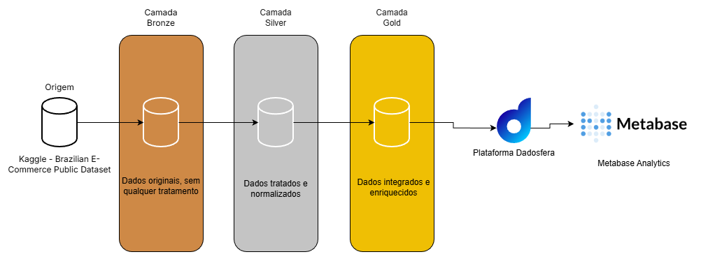

# Case Dadosfera - Pipeline de Dados com Arquitetura Medallion

Este projeto tem como objetivo demonstrar a aplicação prática de um pipeline de dados utilizando a arquitetura Medallion, desde a ingestão bruta até a entrega de insights analíticos. Utilizando o dataset público Brazilian E-Commerce Public Dataset by Olist, o case explora todo o ciclo de vida dos dados, incluindo etapas de tratamento, validação de qualidade e visualização. A plataforma utilizada para análise e visualização dos dados é a Dadosfera, que oferece recursos robustos para exploração e criação de dashboards interativos.

## ITEM 1 - Escolha dos dados

Este projeto utiliza o Brazilian E-Commerce Public Dataset by Olist, um conjunto de dados públicos que representa aproximadamente 100 mil pedidos reais realizados entre 2016 e 2018 em múltiplos marketplaces no Brasil.

### Diagrama do Dataset na Origem (Raw)


O dataset foi anonimizado e disponibilizado pela Olist, uma das maiores plataformas de integração entre pequenos e médios vendedores e grandes canais de e-commerce no país. Ele retrata todo o ciclo de vida de um pedido, desde a criação da ordem até a entrega e a avaliação final do cliente.

A estrutura do dataset permite analisar o negócio sob múltiplas perspectivas, incluindo:

- Operacional (status do pedido, prazos de entrega, atrasos)

- Financeira (preço, frete, faturamento, meios de pagamento)

- Comercial (produtos, categorias, vendedores)

- Experiência do cliente (avaliações e comentários)

- Geográfica (localização de clientes e vendedores via CEP, latitude e longitude)

Além disso, o conjunto de dados de geolocalização possibilita análises espaciais e regionais, ampliando o potencial analítico do projeto.

[Pasta com originais e transformações](/data)

## ITEM 2 - Ingestão no Google Colab para tratamento

Os dados foram ingeridos em forma raw no Google Colab, onde foram tratados e organizados conforme o modelo medallion proposto para posterior carga no ambiente de análise da Dadosfera. O ambiente do Colab possibilitou a utilização de bibliotecas como Pandas e Spark para manipulação dos dados e great_expectations para validação de qualidade, além de facilitar a visualização e validação dos resultados intermediários.

### Estrutura de pastas:

A seguinte estrutura de pastas foi utilizada no Colab/Drive para organizar os dados:

# Item 2/6 Arquitetura Medallion

O projeto adotou a arquitetura Medallion para organizar o fluxo de dados em três camadas distintas: Bronze, Silver e Gold. Cada camada possui um propósito específico na jornada dos dados, desde a ingestão bruta até a entrega de insights analíticos.

## Arquitetura Anterior:


### - Figura da Arquitetura Medallion e Star Schema:


## Ingestão bruta na camada Bronze

A camada Bronze recebeu os dados brutos diretamente do dataset público, sem transformações ou limpezas. O objetivo desta camada é preservar a integridade dos dados originais para futuras referências e auditorias.

### Dados da Camada Bronze:


## Transformações para a camada Silver

Na camada Silver do modelo Medallion, os dados provenientes da camada Bronze foram submetidos a processos de limpeza, padronização e enriquecimento, com o objetivo de torná-los consistentes e prontos para análise. Nessa etapa, foram realizadas conversões de tipos de dados, especialmente para campos temporais e numéricos, garantindo correta interpretação de datas, valores monetários e dimensões de produtos.

Também foi aplicada a normalização de campos textuais, como cidades, categorias e comentários de avaliações, reduzindo inconsistências de escrita. Registros duplicados foram removidos com base nas chaves principais de cada entidade, assegurando integridade dos dados.

Além disso, foram criadas métricas derivadas relevantes para o domínio do negócio, incluindo o cálculo do atraso de entrega em dias, o volume físico dos produtos e o valor total por item considerando produto e frete. Transformações auxiliares, como a aplicação de logaritmo em variáveis financeiras, foram adicionadas para apoiar análises estatísticas futuras.

Ao final, a camada Silver consolida um conjunto de dados limpo, padronizado e enriquecido, servindo como base confiável para análises analíticas e construção da camada Gold.

### Exemplos de transformações realizadas na camada Silver:


## Transformações para a camada Gold

A camada Gold representa o nível final do modelo Medallion, onde os dados tratados da camada Silver são integrados e agregados para suportar análises analíticas e consumo por ferramentas de BI. Nesta etapa, foi construída uma tabela fato de vendas (fact_sales) a partir da junção das entidades de pedidos, itens, produtos, avaliações e clientes.

Com base nessa estrutura, foram geradas visões analíticas específicas, incluindo a evolução mensal do faturamento, o ranking das principais categorias por receita, a avaliação média dos produtos considerando volume mínimo de pedidos, a distribuição de receita por estado e um conjunto de KPIs globais do negócio, como total de pedidos, clientes, faturamento e ticket médio.

As agregações foram realizadas utilizando funções nativas do Spark, garantindo eficiência no processamento e padronização dos resultados. Os dados finais foram persistidos em formato CSV, prontos para consumo por dashboards, relatórios executivos e aplicações analíticas.

### Exemplos de visões analíticas criadas na camada Gold:


## ITEM 2.1 - Ingestão na Dadosfera

A ingestão foi feita a partir do Google Sheets, conectando diretamente ao ambiente da Dadosfera para análise e visualização dos dados tratados na camada silver para posterior análise no Metabase. A plataforma da Dadosfera possibilitou a criação de dashboards interativos, facilitando a exploração dos insights gerados a partir do dataset.

## Conexão com Google Sheets e Pipelines:


## Exemplo de Tabelas:


## Dashboard Criado:


## EXEMPLO DE SQL UTILIZADO NO METABASE PARA CRIAÇÃO DE DASHBOARDS:
```sql
-- Exemplo: Faturamento Mensal

```

## Item 3 - Catalogo de Dados na Dadosfera

As tabelas receberam descrição e nomes amigáveis para facilitar a compreensão dos dados pelos usuários da plataforma. Cada coluna foi documentada com informações sobre seu significado, tipo de dado e possíveis valores, promovendo transparência e facilitando a exploração dos dados.

### Exemplo de Tabelas Documentadas:


## ITEM 4 - Validação de qualidade dos dados

A validação de qualidade dos dados foi realizada utilizando a ferramenta Great Expectations, aplicada sobre os dados da camada CDM Silver, após o processo de limpeza e padronização. Para cada dataset (orders, order_items, payments, reviews, customers, sellers, products e geolocation), foram definidas expectativas específicas relacionadas a integridade, consistência e plausibilidade dos dados.

As validações incluíram verificações de valores nulos, unicidade de chaves primárias e compostas, limites aceitáveis para valores numéricos (como preços, fretes, avaliações e coordenadas geográficas), conformidade de domínios categóricos (status de pedidos) e formatos esperados (UFs com duas letras). Cada dataset foi validado de forma independente, gerando métricas de sucesso, percentual de conformidade e quantidade de expectativas atendidas ou violadas.

Os resultados foram consolidados em relatórios estruturados nos formatos JSON (detalhado e resumido) e Markdown, permitindo fácil auditoria, rastreabilidade e acompanhamento da qualidade dos dados ao longo do pipeline.

### Exemplo de validação e relatório gerado:


## Item 5 - Uso de Gen AI e LLMs para enriquecimento dos dados

Utilizando a biblioteca transformers no Google Colab, foram geradas features de análise de sentimento e tópicos a partir das reviews dos clientes. Essas features foram então carregadas em um aplicativo Streamlit para exploração interativa.

### Trecho de Código Utilizado:


## ITEM 8 - Pipeline de Dados Silver -> Gold utilizando Spark

O pipeline de dados foi implementado utilizando Apache Spark para processar e transformar os dados da camada Silver em visões analíticas na camada Gold. O código exemplifica uma das transformações realizadas, especificamente a criação da tabela fato de vendas (fact_sales) a partir da junção das entidades relevantes.


## ITEM 9 - Stream Lit App para Análise de Reviews com LLM (Foi utilizado uma amostra na LLM devido ao limite de tokens no caso do modelo gratuito)

Link para aplicação no [Streamlit Cloud](https://edivancarvalhoddftech122025-y4tvzmsvbwkdcxefeby4xy.streamlit.app/)

# O que o dashboard mostra
- **KPIs globais**: total de pedidos, clientes, receita total e ticket médio (`kpi_global/`)
- **Evolução mensal do faturamento** (`revenue_monthly/`)
- **Top 10 categorias por faturamento** (`revenue_category/`)
- **Avaliação x volume de pedidos por categoria** (`review_category/`)
- **Top 10 estados por receita** (`revenue_state/`)

## LLM Insights (amostra)

- KPIs da amostra: quantidade de reviews, % mismatch, sentimento médio, atraso médio
> Observação: foi usada **amostragem** para gerar features de LLM por limites de custo/tempo em ambiente gratuito.

## Item 10 - Comparação Arquitetura Anterior (AWS) x Solução Proposta (Dadosfera + Medallion)

A arquitetura anterior (AWS) é baseada em um fluxo de eventos em tempo real, onde um **Generator** publica dados em **Kinesis Stream**, que são entregues via **Firehose** para armazenamento em **S3** e consumo rápido por **Redis**. Esse modelo é eficiente para cenários de streaming e baixa latência, porém envolve múltiplos componentes para operar e evoluir (ingestão, entrega, armazenamento, serving, permissões, catálogo, qualidade e camada de analytics), o que tende a aumentar o esforço de manutenção e o tempo de entrega de valor para o negócio.

Neste case, a solução proposta utiliza a **Dadosfera** como base de plataforma de dados e organiza o pipeline com a arquitetura **Medallion (Bronze/Silver/Gold)**, com o objetivo de reduzir o caminho entre dados e valor. A plataforma centraliza as etapas de **Integrar, Processar, Explorar e Analisar**, com **governança (IAM)**, **catálogo** e **analytics (Metabase)** integrados, facilitando a criação de ativos reutilizáveis e escaláveis para o negócio.

### Diagrama da Solução Proposta:



### Principais melhorias observadas

- **Menos complexidade operacional:** em vez de manter múltiplos serviços separados e integrações entre eles, a solução proposta concentra o fluxo em pipelines + camadas Medallion + catálogo + dashboards, reduzindo pontos de falha e retrabalho.
- **Rastreabilidade e qualidade por camada:** Bronze preserva o dado original; Silver aplica padronização, enriquecimento e validação de qualidade (Great Expectations); Gold consolida visões e KPIs prontos para consumo, evitando divergência de métricas.
- **Governança e entendimento embutidos:** ativos catalogados, descrições e nomes amigáveis permitem que usuários encontrem e compreendam dados com menos dependência de um time altamente especializado.
- **Time-to-market mais rápido:** com ingestão, organização, catálogo e visualização no mesmo ecossistema, o ciclo para disponibilizar insights se torna mais curto.
- **Base pronta para IA aplicada ao negócio:** a camada Gold e os ativos catalogados facilitam evolução para modelos de IA/GenAI. No case, foi demonstrado enriquecimento de reviews com features (sentimento e tópicos) e disponibilização via Streamlit.